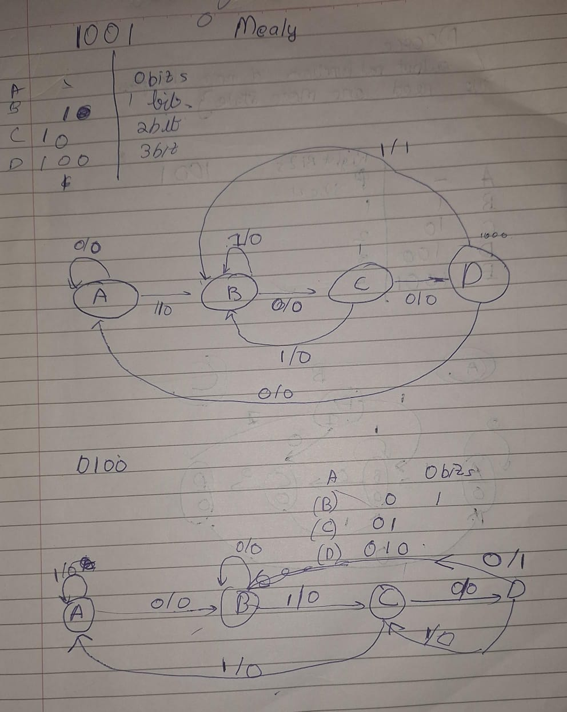
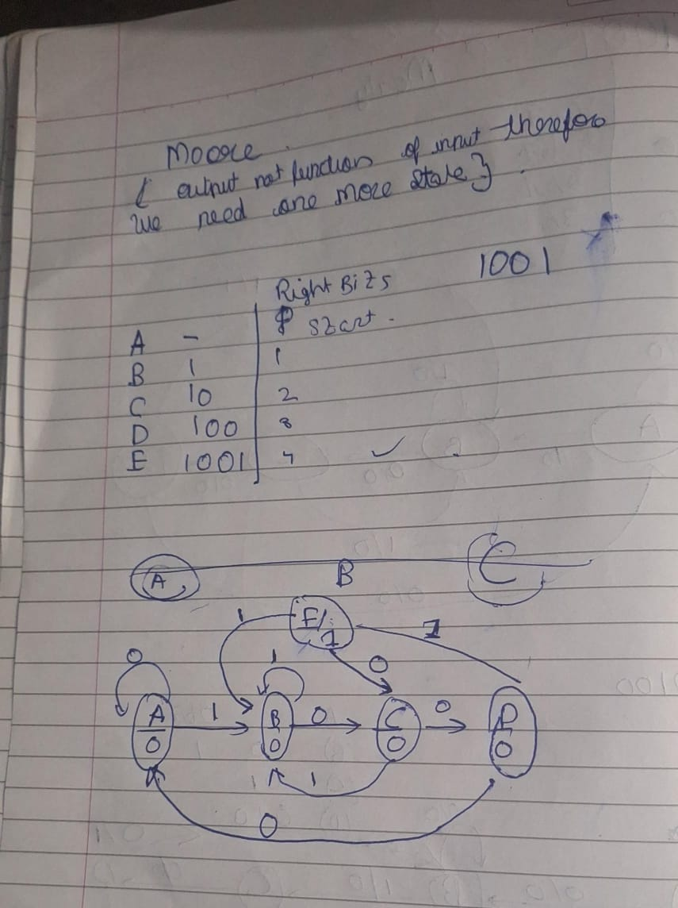

# Mealy for 1001 and 0100

##Mealy FSM
output values  givee by both by its *current state and the current inputs*.

#Moore
output values  givee by both by its *current state* only.
## Mealy for 1001 and 0100

## Moore  0100

|Mealy| Moore|
| ----------- | ----------- |
|Output is the function of preseent state and inputs|only present state|
|output is not synchronized|output is in sync with clock|
|responds to change quickly|next clock cycle edge|
|less hardware|more hardware|

