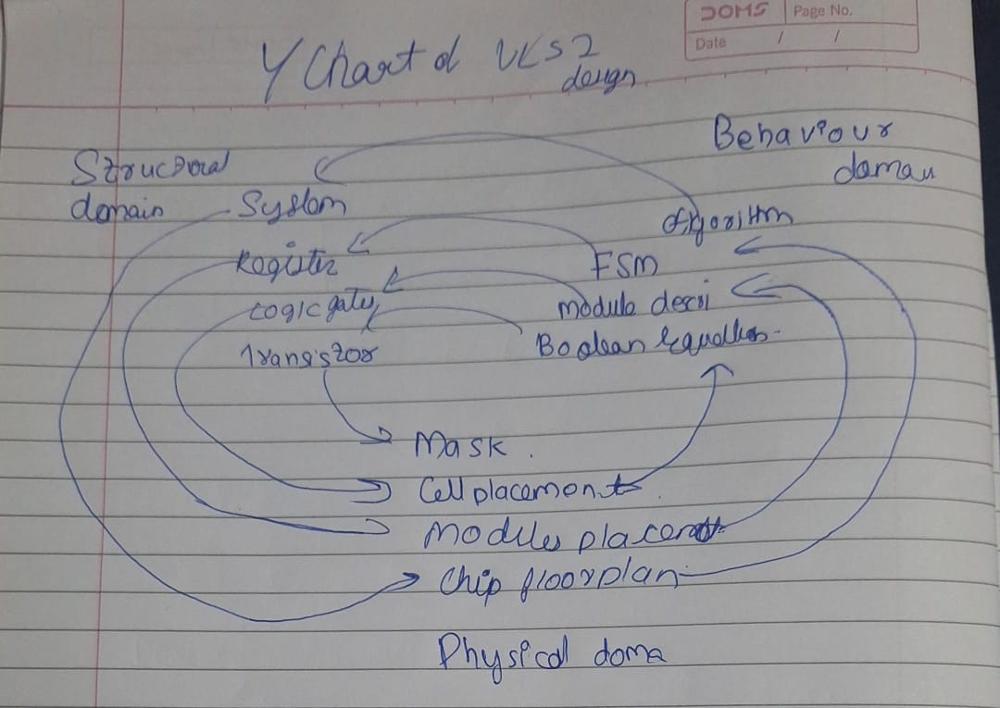

1. **Specification:**
   -  specifications and requirements for the integrated circuit (IC), are decided, like deciding the purpose for the chip/

2. **Architecture Design:**
   - architecture for the IC, outlining major functional blocks and their interconnections. Giving outline design

3. **RTL Design:**
   -  Register Transfer Level (RTL) description of the design using a hardware description language (HDL) like Verilog. Since we can't directly fabricate the chip we need to design using HDL and see whether it meets our requirements in the next step

4. **Functional Verification:**
   - Verify the correctness of the RTL description through simulation

5. **Floorplanning:**
   - Plan the physical layout of the chip, placing major blocks and defining the overall structure.

6. **Place and Route:**
   - Assign locations for each gate and route the interconnections to create a physical layout.

7. **Physical Verification:**
   - Ensure the design adheres to physical design rules

8. **Extraction:**
   - Extract parasitic information from the layout to refine the timing analysis.

9.  **Simulation and Timing Analysis:**
    - Simulate the post-layout design and analyze the timing characteristics to ensure performance meets specifications.

10. **Mask Generation:**
    - mask 

11. **Fabrication:**
    - making of the semiconductor wafers  and printing / final placement of connections

12. **Assembly and Testing:**
    - Package the fabricated IC, perform final testing, and verify that it meets all functional and performance requirements.

13. **Production:**
    - Once the design meets specifications, it can move into mass production.

